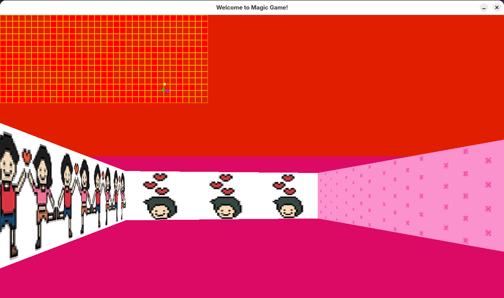
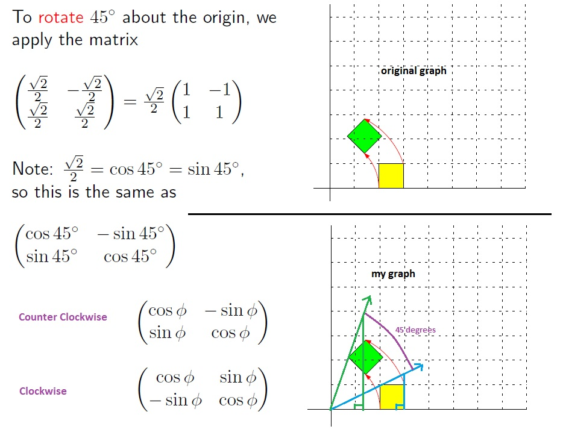

*This project has been created as part of the 42 curriculum by tmottini, ylang*


# Description 

This project is to recreate a simple `First Person Shooter` 3D game inspired by `Wolfenstein 3D` using the MiniLibX graphics library. The goal is to build a raycasting engine from scratch, handling everything from parsing the map file to rendering textured walls and handling user input (keyboard and mouse).

Beyond graphics programming, the project is a practical introduction to computational geometry and linear algebra, particularly the use of vectors, matrix and Digital Differential Analyzer(DDA) algorithm for raycasting.

# Project Structure 

The project is separated mainly into 2 parts :
1. Parsing (by `tmottini`)
    - Validate the `.cub` configuration file
    - Parse textures, colors, player information and the map 
2. Rendering (by `ylang`)
    - Render the world using a raycasting engine
    - Handle player movement, collision detection and keyboard events 
```
srcs/
    parsing/
    render/
    init/
    exit/
    main.c
includes/
libft/
minilibx-linux/
textures/
maps/
```
# Instructions

```bash
git clone <repo_url>
cd cub3d
make
./cub3D ./maps/map.cub
```

# Gameplay 
Once launched, the player spawns inside the maze and can freely explore the map. A minimap displayed in the top-left corner shows the player's position and viewing direction in real time.


# Feature list

Operations supported: 
- W - Move forward
- S - Move backward
- A - Move leftward
- D - Move rightward
- LEFT ARROW <- - Rotate leftward
- RIGHT ARROW -> - Rotate rightward
- ESC - Exit game
- Click 'X' on the top right cornor of the window - Exit game 

Minimap is also supported:
- green dot : player position 
- yellow line + dot: player viewing direction
- pink line + dot: camera plane direction

# Technical choices

## Technical Design

The project is divided into two independent modules:

- Parsing
- Rendering

Both modules communicate through a shared `t_game` structure, which stores all parsed data, textures, player information and rendering state. This interface allowed both developers to work independently while keeping integration straightforward.

## Parsing 

leave to tony.....

## Rendering 

### 1. Raycasting

Each screen column casts one ray into the map. The Digital Differential Analyzer (DDA) algorithm is used to efficiently step from one grid cell to the next until a wall is hit.

### 2. Camera representation

Instead of storing the player's viewing direction as an angle, the renderer stores: `a direction vector` 
,`a camera plane vector`.
This allows rotation to be implemented with simple matrix multiplication and follows the approach described in Lode Vandevenne's [raycasting tutorial](https://lodev.org/cgtutor/raycasting.html).


### 3. How to avoid fish-eye effect

Instead of using the Euclidean distance between the player and the wall, the renderer computes the perpendicular wall distance. This removes the fish-eye distortion that would otherwise appear near the edges of the screen.

### 4. Rotate a certain angle = multiple a rotation matrix



# Resources


- [A very detailed explanation of Raycasting](https://lodev.org/cgtutor/raycasting.html)
- [How to draw a pixel on the window with MLX?](https://gontjarow.github.io/MiniLibX/mlx-tutorial-draw-pixel.html)
- [Youtube - Super Fast Ray Casting in Tiled Worlds using DDA](https://www.youtube.com/watch?v=NbSee-XM7WA )

